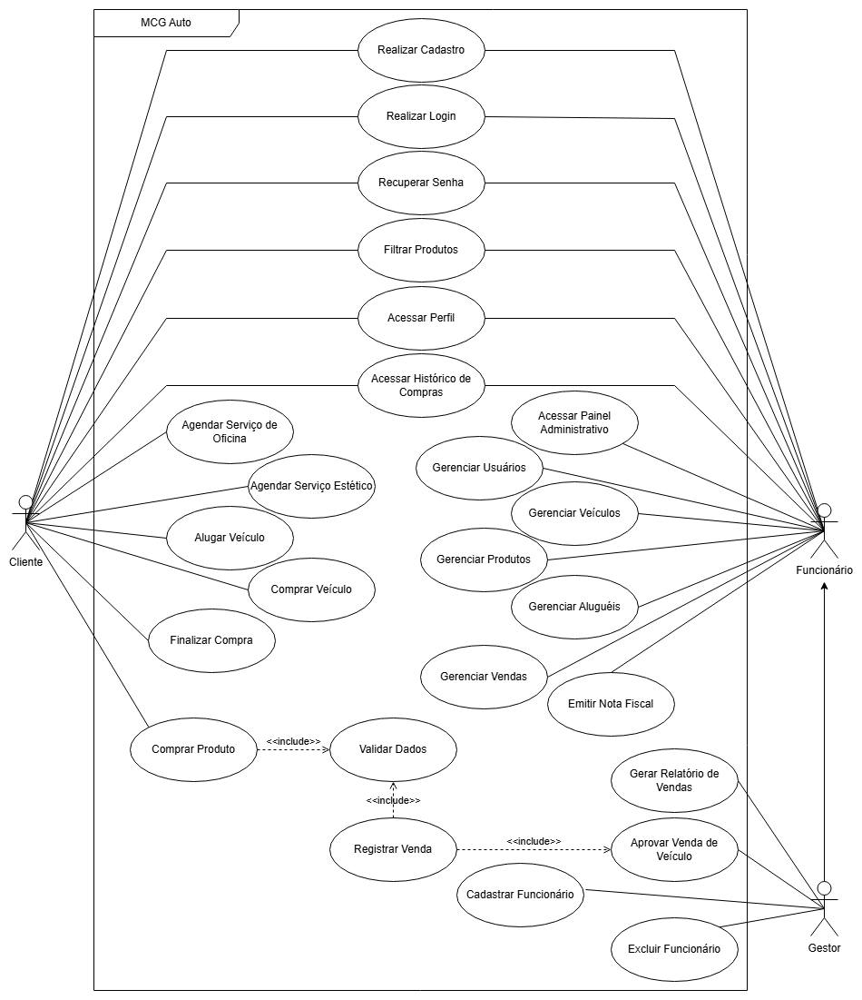
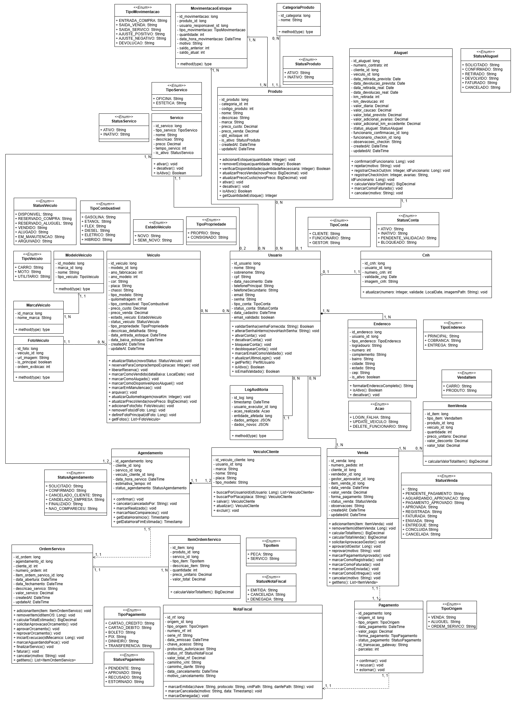
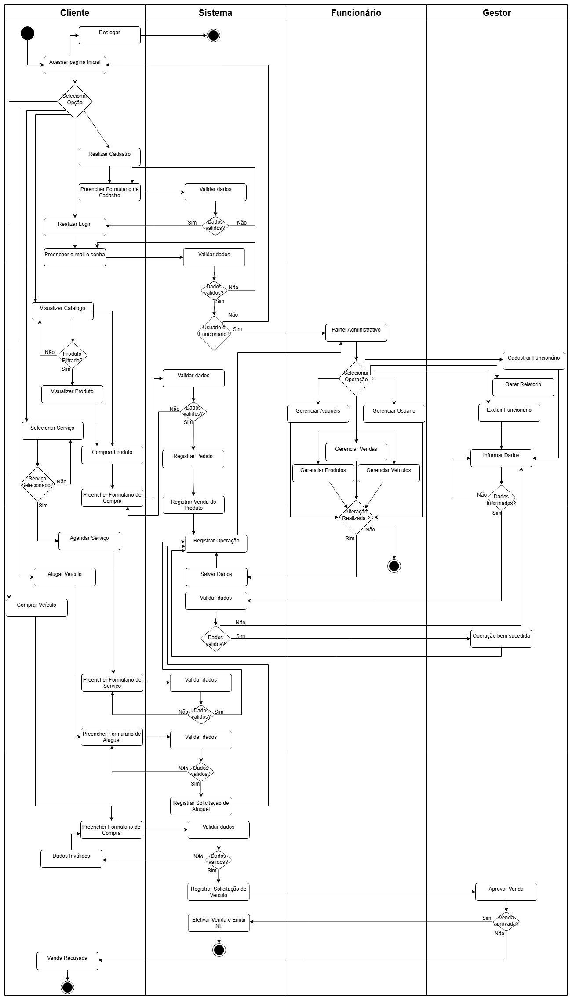

# Documentacao Tecnica - MCG Auto

Este documento detalha a engenharia de software por tras do sistema MCG Auto, cobrindo requisitos, regras de negocio e modelagem visual baseada nos padroes UML.

---

## 1. Modelagem Visual (UML)

Abaixo estao os diagramas essenciais que guiaram a arquitetura e os fluxos do sistema.

### 1.1 Diagrama de Casos de Uso (Geral)
Representa o escopo funcional do sistema e as interacoes entre os atores (Cliente, Funcionario e Gestor). Ele define "o que" o sistema faz, como os processos de Venda, Locacao e Oficina.

### 1.2 Diagrama de Classes (Dominio)
Detalha a estrutura estatica do banco de dados e das entidades JPA. Aqui estao definidas as classes principais como `Veiculo`, `Venda`, `Aluguel` e seus relacionamentos (Associacao, Composicao).

### 1.3 Diagrama de Atividades (Fluxo)
Ilustra o fluxo de controle dos processos mais complexos, detalhando as decisoes ("Pagamento Aprovado?") e as responsabilidades de cada raia (Cliente vs Sistema vs Funcionario).

---

## 2. Requisitos Funcionais (RF)

Funcionalidades core mapeadas para o desenvolvimento:

| ID | Modulo | Descricao |
| :--- | :--- | :--- |
| **RF01** | Autenticacao | Realizar Cadastro de novos clientes (Autoatendimento). |
| **RF02** | Autenticacao | Realizar Login com niveis de acesso distintos. |
| **RF03** | Autenticacao | Recuperar Senha via e-mail. |
| **RF04** | Catalogo | Filtrar Produtos e Veiculos por categorias e atributos. |
| **RF05** | Perfil | Acessar e editar informacoes do Perfil do usuario. |
| **RF06** | Historico | Visualizar Historico de Compras e Servicos. |
| **RF07** | Oficina | Agendar Servicos mecanicos verificando disponibilidade. |
| **RF08** | Oficina | Agendar servicos de Estetica automotiva. |
| **RF09** | Locacao | Solicitar Aluguel de veiculo. |
| **RF10** | Vendas | Comprar Veiculo (Checkout online). |
| **RF11** | Vendas | Comprar Produto/Pecas. |
| **RF12** | Vendas | Validar Dados de pagamento e cadastro. |
| **RF13** | Vendas | Finalizar Compra e gerar pedido. |
| **RF14** | Admin | Acesso ao Painel Administrativo. |
| **RF15** | Admin | Gerenciar Usuarios (CRUD). |
| **RF16** | Estoque | Gerenciar Veiculos (Cadastro/Edicao). |
| **RF17** | Estoque | Gerenciar Produtos e Pecas. |
| **RF18** | Locacao | Gerenciar solicitacoes de Alugueis. |
| **RF19** | Vendas | Gerenciar status de Vendas. |
| **RF20** | Vendas | Aprovar Venda de Veiculo (Gestor). |
| **RF21** | Vendas | Registrar Venda e baixar estoque. |
| **RF22** | Fiscal | Emitir Nota Fiscal. |
| **RF23** | Relatorios | Gerar Relatorio de Vendas. |
| **RF24** | Admin | Cadastrar novos Funcionarios. |
| **RF25** | Admin | Excluir/Desativar Funcionarios. |

---

## 3. Requisitos Nao Funcionais (RNF)

Restricoes tecnicas e padroes de qualidade:

| ID | Categoria | Descricao |
| :--- | :--- | :--- |
| **RNF01** | Usabilidade | Interface intuitiva com foco em UX. |
| **RNF02** | Seguranca | Senhas armazenadas com criptografia forte (Hash). |
| **RNF03** | Conectividade | Comunicacao forcada via HTTPS/TLS. |
| **RNF04** | Disponibilidade | SLA de 99.5% de uptime. |
| **RNF05** | Disponibilidade | Rotinas diarias automaticas de backup. |
| **RNF06** | Acessibilidade | Design responsivo (Desktop/Mobile). |
| **RNF07** | Portabilidade | Relatorios exportaveis em PDF. |
| **RNF08** | Integracao | Integracao com Gateway de Pagamento. |
| **RNF09** | Compliance | Padroes fiscais brasileiros (CPF/CNPJ). |
| **RNF10** | Seguranca | Controle de Acesso (RBAC) por perfis. |

---

## 4. Regras de Negocio (RN) Completas

Regras de negócio que garantem a integridade do sistema:

| ID | Categoria | Regra |
| :--- | :--- | :--- |
| **RN01** | Cadastro | O CPF do cliente deve ser unico no sistema. |
| **RN02** | Cadastro | O E-mail do cliente deve ser unico no sistema. |
| **RN03** | Seguranca | A senha deve conter no minimo 8 caracteres (letras e numeros). |
| **RN04** | Cadastro | O sistema deve validar o formato do CPF e E-mail. |
| **RN05** | Cadastro | Cliente deve ser maior de 18 anos. |
| **RN06** | Cadastro | O cadastro de endereco e obrigatorio para compras. |
| **RN07** | Acesso | O login e bloqueado apos 5 tentativas falhas. |
| **RN08** | Acesso | A sessao expira apos 30 minutos de inatividade. |
| **RN09** | Catalogo | Produtos sem estoque nao podem ser vendidos (apenas visualizados). |
| **RN10** | Catalogo | O preco do veiculo deve ser exibido a vista e parcelado. |
| **RN11** | Catalogo | A busca deve permitir filtros por marca, modelo e ano. |
| **RN12** | Perfil | O cliente nao pode alterar seu CPF apos cadastro. |
| **RN13** | Seguranca | A nova senha nao pode ser igual as ultimas 3 utilizadas. |
| **RN14** | Historico | O historico de compras nao pode ser excluido pelo cliente. |
| **RN15** | Oficina | O agendamento deve respeitar os horarios de funcionamento. |
| **RN16** | Oficina | Nao e permitido agendar se nao houver mecanico disponivel. |
| **RN17** | Oficina | O cliente pode cancelar agendamento com 24h de antecedencia. |
| **RN18** | Oficina | O sistema deve enviar confirmacao de agendamento por e-mail. |
| **RN19** | Locacao | O periodo minimo de aluguel e de 1 diaria (24h). |
| **RN20** | Locacao | O valor da diaria varia conforme a categoria do veiculo. |
| **RN21** | Locacao | E cobrada multa por atraso na devolucao. |
| **RN22** | Locacao | O veiculo deve ser devolvido com tanque cheio ou pagar taxa. |
| **RN23** | Locacao | Obrigatorio apresentar CNH valida para retirar veiculo. |
| **RN24** | Locacao | O pagamento do aluguel e feito na retirada (caucao/cartao). |
| **RN25** | Locacao | Veiculos "Vendidos" nao podem ser alugados. |
| **RN26** | Vendas | O carrinho de compras persiste ate o fim da sessao. |
| **RN27** | Vendas | O sistema verifica disponibilidade do item no momento do checkout. |
| **RN28** | Vendas | O frete e calculado com base no CEP de entrega (Pecas). |
| **RN29** | Vendas | Veiculos so podem ser retirados na loja fisica. |
| **RN30** | Vendas | O pagamento pode ser via cartao, boleto ou PIX. |
| **RN31** | Vendas | O pedido so e processado apos confirmacao do pagamento. |
| **RN32** | Vendas | O cliente recebe e-mail a cada mudanca de status do pedido. |
| **RN33** | Vendas | Cancelamento so e permitido antes da emissao da Nota Fiscal. |
| **RN34** | Vendas | Baixa automatica de estoque apos confirmacao de pagamento. |
| **RN35** | Admin | O painel administrativo e restrito a funcionarios ativos. |
| **RN36** | Admin | Apenas Gestores podem criar novos usuarios administrativos. |
| **RN37** | Admin | O sistema deve registrar log de todas as acoes no painel. |
| **RN38** | Admin | Funcionarios nao podem visualizar senhas de clientes. |
| **RN39** | Estoque | O chassi do veiculo deve ser unico no sistema. |
| **RN40** | Estoque | A placa do veiculo deve ser unica e valida. |
| **RN41** | Estoque | Cadastro de veiculo exige: Marca, Modelo, Ano, Cor, Km. |
| **RN42** | Estoque | Imagens do veiculo sao obrigatorias para exibicao no site. |
| **RN43** | Estoque | Produtos tem estoque minimo para alerta de reposicao. |
| **RN44** | Estoque | Veiculos com historico nao podem ser excluidos (apenas inativados). |
| **RN45** | Financeiro | Preco de venda nao pode ser menor que preco de custo. |
| **RN46** | Financeiro | Veiculo vendido torna-se imutavel no cadastro. |
| **RN47** | Locacao | O status do aluguel muda para "Em Andamento" na retirada. |
| **RN48** | Locacao | O status muda para "Concluido" apos vistoria de devolucao. |
| **RN49** | Locacao | Danos identificados na vistoria sao cobrados do cliente. |
| **RN50** | Locacao | O sistema bloqueia aluguel para clientes inadimplentes. |
| **RN51** | Locacao | Funcionario deve validar CNH visualmente. |
| **RN52** | Vendas | Status da venda: Iniciada -> Aguardando Aprovacao -> Aprovada. |
| **RN53** | Vendas | Venda de veiculo bloqueia o item para outros clientes. |
| **RN54** | Vendas | Se o pagamento falhar, o veiculo volta a ficar disponivel. |
| **RN55** | Fiscal | Nota Fiscal e gerada automaticamente apos aprovacao. |
| **RN56** | Relatorios | Relatorios podem ser filtrados por data, categoria e status. |
| **RN57** | Admin | Apenas Gestor pode aprovar venda de veiculo. |
| **RN58** | Admin | Apenas Gestor pode estornar uma venda. |
| **RN59** | Admin | O cadastro de funcionario exige CPF, Nome e Cargo. |
| **RN60** | Admin | Funcionario demitido perde acesso imediato ao sistema. |
| **RN61** | Admin | Gestor nao pode excluir sua propria conta. |
| **RN62** | Admin | Ao excluir funcionario, tarefas pendentes devem ser redistribuidas. |
| **RN63** | Sistema | O sistema deve realizar backup diario as 03:00 AM. |